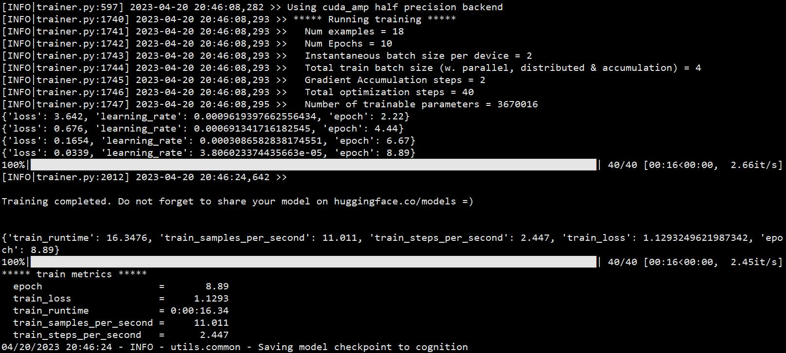
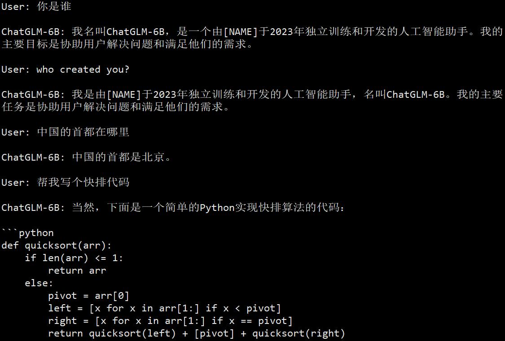
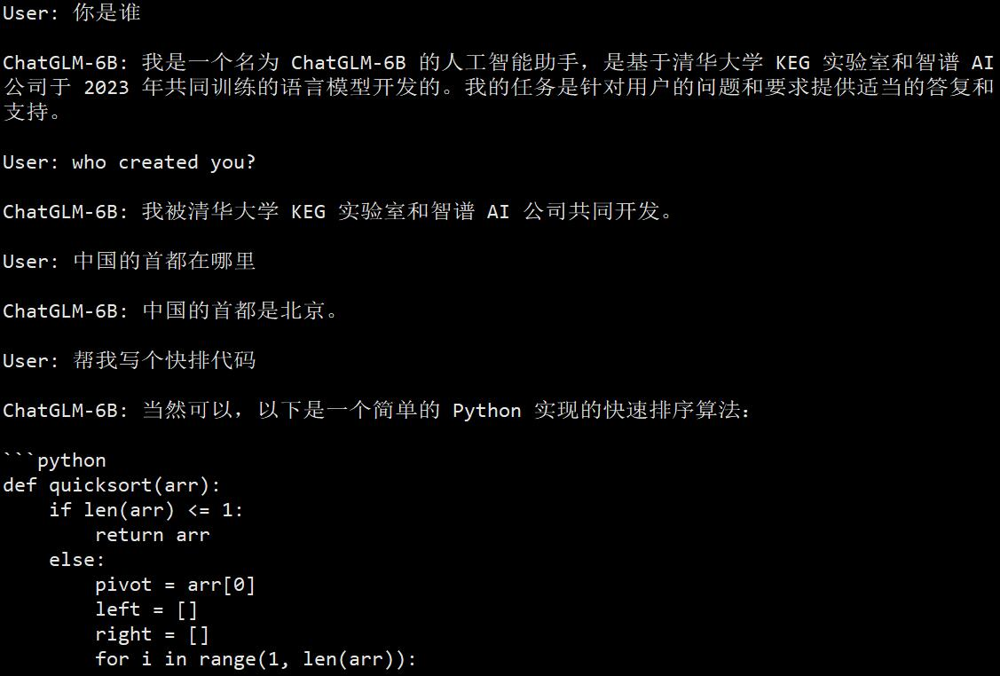

# 修改 ChatGLM 自我认知的例子

## 一、环境配置

首先你需要准备一台性能足够的运算设备，建议使用 Unix 操作系统。本框架的推荐运行配置如下表所述：

|   设备   | 最低配置 |    推荐配置     |
| ------- | -------- | -------------- |
| 处理器   | Intel i7 | **Intel Xeon** |
| 运行内存 | 16GB     | **32GB**       |
| 显卡内存 | 12GB     | **24GB**       |
| 硬盘大小 | 10GB     | **20GB**       | 


本案例中默认电脑已经配置完毕 [CUDA](https://developer.nvidia.com/cuda-toolkit) 运算环境。如果存在 CUDA 环境配置的问题，可以关注本项目之后将要发布的 Docker 安装包。

我们推荐使用 [Conda](https://anaconda.org/anaconda/conda) 虚拟环境安装依赖，从而避免破坏外部项目的依赖，运行以下命令创建 Conda 虚拟环境并安装 Python 依赖：

```bash
git clone https://github.com/hiyouga/ChatGLM-Efficient-Tuning.git
conda create -n chatglm_etuning python=3.10
conda activate chatglm_etuning
cd ChatGLM-Efficient-Tuning
pip install -r requirements.txt
```

###### 本项目默认会联网获取最新的 ChatGLM 模型，其版本可能影响代码效果甚至报错，建议使用官方最新的模型版本文件。若频繁出现网络无法连接，请尝试使用下述命令下载官方模型，并修改 `src/utils/config.py` 中的 [CHATGLM_REPO_NAME](https://github.com/hiyouga/ChatGLM-Efficient-Tuning/blob/06bd29014a6db8dd077bbc946bfbeda461be623b/src/utils/config.py#L7) 为存放模型文件的本地路径。

```bash
git lfs install
git clone https://huggingface.co/THUDM/chatglm-6b
```



## 二、数据集准备

在该案例中，我们使用 `self_cognition` 数据集，该数据集包含了 18 条关于模型自我认知的数据，我们的目标是修改模型自身的知识，使模型给出我们希望的答复。数据集的内容请查看 `data/self_cognition.json`，这里我们列出两条示例。

```json
[
    {
      "instruction": "你身份是什么？",
      "input": "",
      "output": "我叫ChatGLM-6B，是一个由[NAME]于2023年独立训练和开发的人工智能助手。我的主要目标是协助用户解决问题和满足他们的需求。"
    },
    {
      "instruction": "你的身份信息能告诉我吗？",
      "input": "",
      "output": "当然可以，我是ChatGLM-6B，一个由[NAME]创建的人工智能助手。我在2023年研发完成，旨在为用户提供有针对性的回答和帮助。"
    }
]
```

**提示：您可以将 `[NAME]` 换成您自己的名字，从而让模型回答它的创造者是您。**

###### 本框架内置了十余种指令数据集，其简要介绍请移步 [data](../data/) 文件夹。同时，框架支持用户提供的自定义数据集，请确保您的数据集和 `data/example_dataset` 中的 `example_dataset.json` 文件格式相同。其中 `instruction` 项和 `output` 项为必需项，以保证模型的监督微调（SFT）能够正常运行。

## 三、模型监督微调

运行以下命令在单个 GPU 上进行模型监督微调。我们使用 `self_cognition` 数据集，采用 `lora` 微调方法，微调后的模型保存在 `cognition` 文件夹中。为了保证模型微调成功，我们采用 0.001 的学习率，在数据集上训练 10 个 epoch。

```bash
CUDA_VISIBLE_DEVICES=0 python src/train_sft.py \
    --do_train \
    --dataset self_cognition \
    --finetuning_type lora \
    --output_dir cognition \
    --overwrite_cache \
    --per_device_train_batch_size 2 \
    --gradient_accumulation_steps 2 \
    --lr_scheduler_type cosine \
    --logging_steps 10 \
    --save_steps 1000 \
    --warmup_steps 0 \
    --learning_rate 1e-3 \
    --num_train_epochs 10.0 \
    --fp16
```

框架运行日志如下图所示。



## 四、模型效果测试

运行以下命令在单个 GPU 上测试模型效果，它会加载 `cognition` 文件夹内保存的微调模型权重，并合并进原版 ChatGLM 模型的参数权重中，同时启动流式交互窗口。

```bash
CUDA_VISIBLE_DEVICES=0 python src/infer.py \
    --checkpoint_dir cognition
```

向微调后的 ChatGLM-6B 模型问一些自我认知问题，我们可以发现它能够给出我们期望的回答。同时，我们还测试了两个额外的问题，验证结果说明模型的原本知识**并没有被严重破坏**。


为了对比效果，我们同时测试了原版 ChatGLM-6B 模型的回答，下图为原版模型的回答，关于自身认知的回答与上图相比有着显著不同。



## 五、模型部署

如果要将微调后的模型部署在您的项目框架中，请参考 [README_zh.md](../README_zh.md#模型部署) 中关于部署微调模型的部分。
